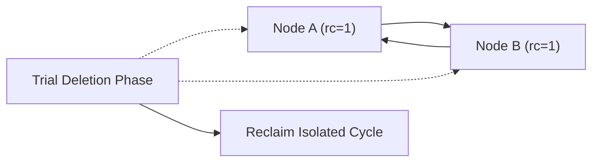

# Reference Counting with Cycle Detection Skill

High-efficiency, zero-dependency Python implementation of **Reference Counting with Concurrent Cycle Detection (Bacon-Rajan Algorithm)**.

## Features
- **Deterministic Prompt Reclamation**: Instantly frees acyclic garbage when reference count drops to 0.
- **Isolated Cycle Resolution**: Detects self-referential clusters that escape naive RC collection.
- **Zero External Dependencies**: Pure Python standard library.
- **Native MCP Protocol**: JSON-RPC 2.0 stdio server compatible with Claude Desktop, Cursor, and Windsurf.

## Architecture

